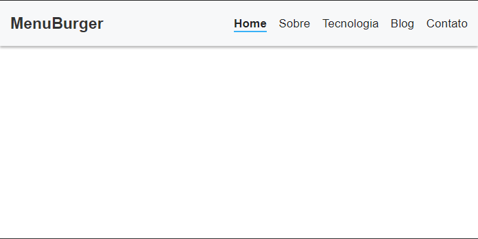
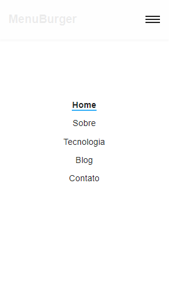

<h1 align="center">
  demoMenuBurger
</h1>

<h2 align="center">
  Uma demonstração prática de menu responsivo
</h2>

  <a href="#sobre-o-projeto">Sobre o projeto</a>&nbsp;&nbsp;&nbsp;|&nbsp;&nbsp;&nbsp;
  <a href="#get-started">Get Started</a>&nbsp;&nbsp;&nbsp;|&nbsp;&nbsp;&nbsp;
  <a href="#licença">Licença</a>

---

## Sobre o projeto
Este projeto é uma simples demonstração do funcionamento de um menu responsivo do tipo burger, com os itens centralizados na tela quando aberto em modo mobile, veja a demonstração nas imagens abaixo;

  

  

## Get Started

Basta baixar o projeto e abrir o arquivo [index.html](./index.html) em seu navegador.

## Licença
Esse projeto está sob licença MIT, veja o arquivo de [LICENSE](./LICENSE) para mais detalhes

___
By Mauricio Redmerski André